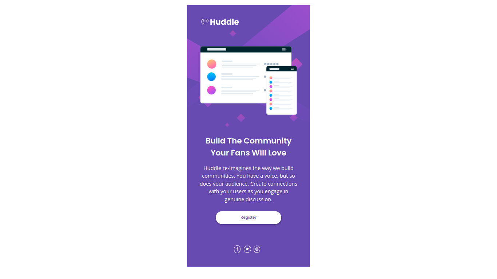

# Frontend Mentor - Huddle landing page with single introductory section solution

This is a solution to the [Huddle landing page with single introductory section challenge on Frontend Mentor](https://www.frontendmentor.io/challenges/huddle-landing-page-with-a-single-introductory-section-B_2Wvxgi0). Frontend Mentor challenges help you improve your coding skills by building realistic projects. 

## Table of contents

  - [Overview](#overview)
  - [The challenge](#the-challenge)
  - [Screenshot](#screenshot)
  - [Links](#links)
  - [Built with](#built-with)
  - [Author](#author)
  - [Acknowledgments](#acknowledgments)

## Overview

### The challenge

Users should be able to:

- View the optimal layout for the page depending on their device's screen size
- See hover states for all interactive elements on the page

### Screenshot
 ## Mobile

 ## Desktop
 

### Links

- [Github](https://github.com/Have-Samuel/Huddle-landing-page)
- [Live Link](https://gleaming-huddle.netlify.app/)

## My process

### Built with

- Semantic HTML5 markup
- CSS custom properties
- CSS Grid
- Mobile-first workflow
- Positioning concepts

## Author

- [Github](https://github.com/Have-Samuel)
- [@Have-Samuel](https://www.frontendmentor.io/profile/Have-Samuel)
- [@samhave1](https://twitter.com/samhave1)
- [LinkedIn](https://www.linkedin.com/in/have-samuel/)

## 🤝 Contributing

Contributions, issues, and feature requests are welcome!

Feel free to check the [issues page](https://github.com/Have-Samuel/Huddle-landing-page/issues).

## Show your support

Give a ⭐️ if you like this project!

## Acknowledgments

- Thanks to Frontend Mentor
- 👋 Thumbs Up to [@Trekab](https://github.com/trekab?tab=overview&from=2020-12-01&to=2020-12-31)
- etc

## 📝 License

This project is [MIT](./MIT.md) licensed.